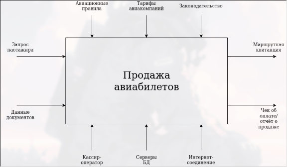
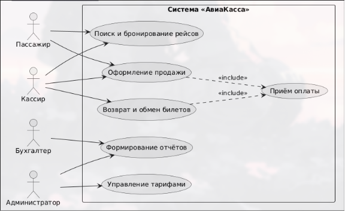
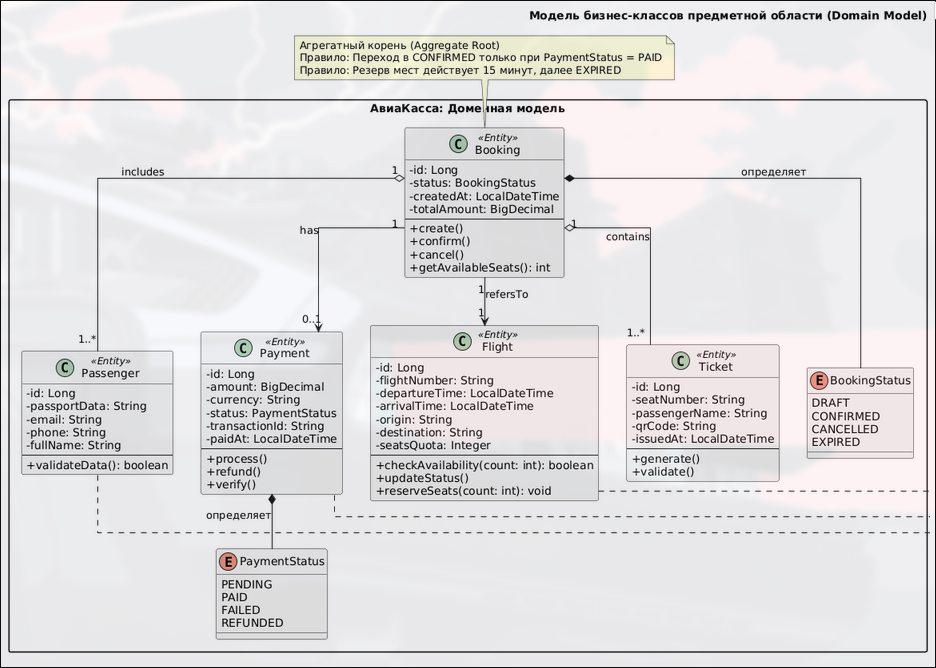

# Этап 0: Инициация и бизнес-анализ

## Цель этапа

Определить бизнес-контекст проекта, выявить заинтересованные стороны, сформулировать основные цели и ограничения, а также создать глоссарий предметной области для мобильного приложения планирования задач.

## Результаты

- [Паспорт проекта (Executive Summary)](project-passport.md)
- [Глоссарий предметной области](glossary.md)
- Диаграмма бизнес-контекста (IDEF0 A-0)
- Диаграмма бизнес-прецедентов (BUC)
- Модель бизнес-классов
- Матрица стейкхолдеров
- SWOT-анализ текущего процесса планирования

---

## Диаграмма бизнес-контекста (IDEF0 A-0)

Диаграмма верхнего уровня, описывающая входы, выходы, управление и механизмы процесса продажи авиабилетов через систему «Авиакасса».

---

## Диаграмма бизнес-прецедентов (BUC)

Диаграмма, отражающая ключевых участников (кассира, пассажира, администратора, платёжную систему) и основные сценарии взаимодействия с системой.

---

## Модель бизнес-классов

Диаграмма классов предметной области, описывающая основные сущности (Рейс, Бронирование, Пассажир, Оплата, Билет) и связи между ними.

---

## Матрица стейкхолдеров

| Стейкхолдер | Роль / Влияние | Интересы / Ожидания | Влияние (1-5) | Отношение | Стратегия работы |
|-------------|----------------|---------------------|---------------|-----------|------------------|
| Кассир-оператор | Конечный пользователь | Скорость оформления, простой интерфейс, минимум ручного ввода | 5 | + | UX-тестирование, обучение, сбор фидбека |
| Пассажир | Клиент | Прозрачность цен, быстрая оплата, гарантия получения билета | 4 | + | Анализ конверсии, улучшение CJM |
| Бухгалтерия | Внутренний потребитель | Корректные финансовые отчёты, интеграция с 1С/ERP | 3 | 0 | Совместные сессии по форматам данных |
| ИТ-администратор | Техническая поддержка | Стабильность, логирование, простота развёртывания | 2 | + | Документация API, мониторинг |

---

## SWOT-анализ текущего процесса планирования

### СИЛЬНЫЕ СТОРОНЫ (внутренние +)

- Современный технологический стек (React+TS, Spring Boot).
- Высокая производительность веб-интерфейса.
- Гибкость в настройке тарифов и правил бронирования.

### СЛАБЫЕ СТОРОНЫ (внутренние -)

- Отсутствие мобильной и десктопной версий.
- Зависимость от стабильности интернет-соединения.
- Соло-разработка ограничивает параллельную реализацию модулей.

### ВОЗМОЖНОСТИ (внешние +)

- Рост спроса на цифровые каналы продаж авиауслуг.
- Интеграция с программами лояльности авиакомпаний.

### УГРОЗЫ (внешние -)

- Жёсткая конкуренция с крупными онлайн-агрегаторами.
- Изменения в авиационном законодательстве и тарифной политике.
