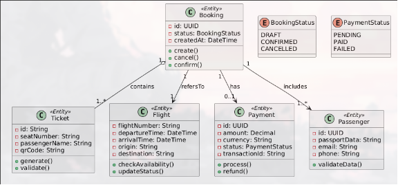

# Модель предметной области (Domain Model)

## Диаграмма

## Описание сущностей

**Booking** — агрегатный корень, фиксирующий факт бронирования. Управляет жизненным циклом транзакции, связывает пассажиров, рейсы и платежи. Содержит уникальный идентификатор, дату создания, общую стоимость и текущий статус бронирования. При создании автоматически инициирует таймер на 15 минут для завершения оплаты.

**Ticket** — конечный продукт продажи. Содержит уникальные данные пассажира, номер места и QR-код для регистрации. Зависит от статуса бронирования: генерируется только после подтверждения оплаты и перехода бронирования в статус `CONFIRMED`. Имеет собственный жизненный цикл: от `ISSUED` до `USED` или `CANCELLED`.

**Flight** — описывает авиарейс. Загружается из ГСБД, содержит расписание, аэропорты отправления/прибытия и текущую доступность мест. Каждый рейс характеризуется номером, датой и временем вылета/прилёта, базовым тарифом и динамически изменяемым количеством свободных мест.

**Payment** — фиксирует финансовую операцию. Связывается с внешней платёжной системой, хранит статус транзакции и идентификатор для отчётности. Содержит сумму платежа, способ оплаты, внешний идентификатор транзакции и временные метки создания и завершения.

**Passenger** — представляет физическое лицо, совершающее перелёт. Содержит паспортные данные (серия, номер, гражданство), контактную информацию (email, телефон) и дату рождения. Данные валидируются перед оформлением на соответствие авиационным стандартам.

## Связи между сущностями

| Связь | Мощность | Описание |
|-------|----------|----------|
| Booking → Flight | N:1 | Одно бронирование относится к одному рейсу; один рейс может иметь множество бронирований. |
| Booking → Passenger | 1:N | Одно бронирование содержит от 1 до 9 пассажиров. |
| Booking → Payment | 1:1 | Каждое бронирование имеет ровно один связанный платёж. |
| Booking → Ticket | 1:N | После подтверждения оплаты для каждого пассажира генерируется отдельный билет. |
| Passenger → Ticket | 1:1 | Каждый пассажир в рамках бронирования получает один билет. |
| Flight → Ticket | 1:N | Один рейс может порождать множество билетов через бронирования. |
