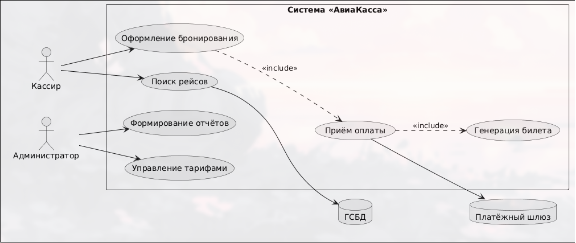

# Диаграмма вариантов использования (Use Case Diagram)

## Диаграмма

## Описание акторов

**Кассир** — основной пользователь системы, осуществляющий поиск рейсов, оформление бронирования, приём оплаты и выдачу маршрутных квитанций.

**Администратор** — управляет тарифами, настройками интеграций с ГСБД и платёжными шлюзами, формирует финансовые отчёты.

**Платёжный шлюз (внешняя система)** — обеспечивает безопасную обработку транзакций, валидацию карт и возврат средств по 54-ФЗ.

**ГСБД (внешняя система)** — предоставляет актуальное расписание рейсов, тарифы, наличие мест и статусы бронирований.

Актор Кассир взаимодействует с системой через два основных сценария: поиск доступных рейсов и оформление бронирования. Процесс бронирования обязательно включает приём оплаты, что отражено отношением `<<include>>`. Это означает, что продажа билета не может быть завершена без финансового подтверждения. Актор Администратор отвечает за поддержание системы: управление тарифами и генерацию отчётности. Внешние системы (Платёжный шлюз и ГСБД) участвуют в процессах оплаты и поиска соответственно, обеспечивая обмен данными через защищённые API-интерфейсы.

## Перечень прецедентов

| ID | Название | Акторы | Описание |
|----|----------|--------|----------|
| UC1 | Поиск авиарейсов | Кассир, ГСБД | Кассир вводит пункт отправления, назначения и желаемую дату. Система запрашивает актуальное расписание в ГСБД и отображает список доступных рейсов с тарифами и наличием мест. |
| UC2 | Оформление бронирования | Кассир, ГСБД | Кассир выбирает рейс, вводит данные пассажиров (1–9 человек), выбирает дополнительные услуги. Система резервирует места на 15 минут и создаёт запись бронирования со статусом `PENDING`. |
| UC3 | Приём оплаты и генерация билета | Кассир, Платёжный шлюз | Система рассчитывает итоговую сумму, инициирует платёж через внешний шлюз. При успешной оплате бронирование переходит в статус `CONFIRMED`, генерируются электронные билеты и отправляются на email пассажиров. |
| UC4 | Отмена бронирования | Кассир | Кассир отменяет бронирование в статусе `PENDING`. Система освобождает зарезервированные места и переводит бронирование в статус `CANCELLED`. |
| UC4 | Формирование отчёта о продажах | Администратор | Администратор задаёт период и фильтры. Система агрегирует данные по платежам и бронированиям, формирует финансовый отчёт в заданном формате. |
