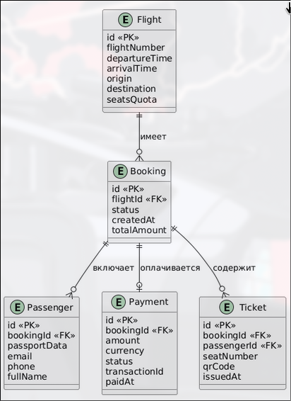

# Этап 3: Проектирование базы данных

## Цель этапа

Разработать логическую и физическую модель данных для серверной части мобильного приложения «Plan Day», создать DDL-скрипты для PostgreSQL и определить стратегию объектно-реляционного отображения (ORM) с использованием JPA/Hibernate.

## Результаты

- [ER-диаграмма логической модели данных](#er-диаграмма-логической-модели-данных)
- [DDL-скрипты для PostgreSQL](#ddl-скрипты-для-postgresql)
- [Описание маппинга JPA-сущностей](#описание-маппинга-jpa-сущностей)

---

## ER-диаграмма логической модели данных



---

## DDL-скрипты для PostgreSQL

Полный скрипт создания схемы базы данных приведён в файле [`ddl.sql`](ddl.sql). Ниже представлено краткое описание таблиц и их назначения.

### Таблицы

| Таблица | Назначение | Ключевые ограничения |
|---------|-----------|---------------------|
| `flights` | Справочник авиарейсов | `chk_flights_status` ∈ {SCHEDULED, DELAYED, CANCELLED, DEPARTED} |
| `bookings` | Факты бронирования | `chk_bookings_status` ∈ {PENDING, CONFIRMED, CANCELLED, EXPIRED} |
| `passengers` | Данные пассажиров | Внешний ключ на `bookings(id)` с `ON DELETE CASCADE` |
| `payments` | Финансовые транзакции | `chk_payments_status` ∈ {PENDING, PAID, FAILED, REFUNDED} |
| `tickets` | Электронные билеты | `chk_tickets_status` ∈ {ISSUED, USED, CANCELLED} |
| `users` | Учётные записи кассиров и администраторов | `chk_users_role` ∈ {ROLE_USER, ROLE_ADMIN} |

### Индексы

Для оптимизации типовых запросов созданы следующие индексы:

- `flights`: по `flight_number` и `departure_time` — ускоряет поиск рейсов.
- `bookings`: по `booking_reference`, `flight_id`, `status`, `created_at` — ускоряет фильтрацию и поиск просроченных бронирований.
- `passengers`: по `booking_id` — ускоряет загрузку пассажиров при чтении бронирования.
- `payments`: по `transaction_id` и `booking_id` — ускоряет обработку вебхуков и поиск платежа.
- `tickets`: по `ticket_number` и `booking_id` — ускоряет поиск билета.
- `users`: по `username` — ускоряет аутентификацию.

---

## Описание маппинга JPA-сущностей

Объектно-реляционное отображение реализовано с помощью **JPA (Hibernate)** и **Lombok** для сокращения шаблонного кода. Стратегия генерации первичных ключей — `GenerationType.IDENTITY` (используется `BIGSERIAL` PostgreSQL).

### Сущности

#### `Flight`

```java
@Entity
@Table(name = "flights")
public class Flight {
    @Id
    @GeneratedValue(strategy = GenerationType.IDENTITY)
    private Long id;

    @Column(name = "flight_number", nullable = false, length = 20)
    private String flightNumber;

    @Column(nullable = false, length = 100)
    private String origin;

    @Column(nullable = false, length = 100)
    private String destination;

    @Column(name = "departure_time", nullable = false)
    private LocalDateTime departureTime;

    @Column(name = "arrival_time", nullable = false)
    private LocalDateTime arrivalTime;

    @Column(name = "seats_quota", nullable = false)
    private Integer seatsQuota;

    @Column(name = "available_seats", nullable = false)
    private Integer availableSeats;

    @Column(name = "base_price", nullable = false, precision = 10, scale = 2)
    private BigDecimal basePrice;

    @Enumerated(EnumType.STRING)
    @Column(nullable = false, length = 20)
    private FlightStatus status = FlightStatus.SCHEDULED;

    @OneToMany(mappedBy = "flight", cascade = CascadeType.ALL, orphanRemoval = true, fetch = FetchType.LAZY)
    private List<Booking> bookings = new ArrayList<>();
}
```

| Атрибут JPA | Описание |
|-------------|----------|
| `@Entity` + `@Table` | Сопоставление с таблицей `flights` |
| `@Enumerated(EnumType.STRING)` | Хранение enum как строки (SCHEDULED, DELAYED и т.д.) |
| `@OneToMany(mappedBy = "flight")` | Двунаправленная связь с `Booking`; `flight` — владеющая сторона |
| `cascade = CascadeType.ALL` | Каскадное применение операций к связанным бронированиям |
| `fetch = FetchType.LAZY` | Ленивая загрузка коллекции бронирований |

#### `Booking`

```java
@Entity
@Table(name = "bookings")
public class Booking {
    @Id
    @GeneratedValue(strategy = GenerationType.IDENTITY)
    private Long id;

    @Column(name = "booking_reference", nullable = false, unique = true, length = 20)
    private String bookingReference;

    @ManyToOne(fetch = FetchType.LAZY)
    @JoinColumn(name = "flight_id", nullable = false)
    private Flight flight;

    @Enumerated(EnumType.STRING)
    @Column(nullable = false, length = 20)
    private BookingStatus status = BookingStatus.PENDING;

    @Column(name = "total_amount", nullable = false, precision = 10, scale = 2)
    private BigDecimal totalAmount;

    @Column(name = "expires_at", nullable = false)
    private LocalDateTime expiresAt;

    @OneToMany(mappedBy = "booking", cascade = CascadeType.ALL, orphanRemoval = true, fetch = FetchType.LAZY)
    private List<Passenger> passengers = new ArrayList<>();

    @OneToMany(mappedBy = "booking", cascade = CascadeType.ALL, orphanRemoval = true, fetch = FetchType.LAZY)
    private List<Payment> payments = new ArrayList<>();

    @OneToMany(mappedBy = "booking", cascade = CascadeType.ALL, orphanRemoval = true, fetch = FetchType.LAZY)
    private List<Ticket> tickets = new ArrayList<>();
}
```

| Атрибут JPA | Описание |
|-------------|----------|
| `@ManyToOne` + `@JoinColumn` | Внешний ключ `flight_id` на таблицу `flights` |
| `@OneToMany` × 3 | Связи с `Passenger`, `Payment`, `Ticket` — каскадное сохранение и удаление |
| `orphanRemoval = true` | Автоматическое удаление дочерних записей при удалении из коллекции |

#### `Passenger`

```java
@Entity
@Table(name = "passengers")
public class Passenger {
    @Id
    @GeneratedValue(strategy = GenerationType.IDENTITY)
    private Long id;

    @ManyToOne(fetch = FetchType.LAZY)
    @JoinColumn(name = "booking_id", nullable = false)
    private Booking booking;

    @Column(name = "first_name", nullable = false, length = 100)
    private String firstName;

    @Column(name = "last_name", nullable = false, length = 100)
    private String lastName;

    @Column(name = "passport_number", nullable = false, length = 50)
    private String passportNumber;

    @Column(name = "date_of_birth", nullable = false)
    private LocalDate dateOfBirth;

    @Column(name = "seat_number", length = 10)
    private String seatNumber;

    @OneToMany(mappedBy = "passenger", cascade = CascadeType.ALL, orphanRemoval = true, fetch = FetchType.LAZY)
    private List<Ticket> tickets = new ArrayList<>();
}
```

#### `Payment`

```java
@Entity
@Table(name = "payments")
public class Payment {
    @Id
    @GeneratedValue(strategy = GenerationType.IDENTITY)
    private Long id;

    @ManyToOne(fetch = FetchType.LAZY)
    @JoinColumn(name = "booking_id", nullable = false)
    private Booking booking;

    @Column(name = "transaction_id", nullable = false, unique = true, length = 100)
    private String transactionId;

    @Column(nullable = false, precision = 10, scale = 2)
    private BigDecimal amount;

    @Enumerated(EnumType.STRING)
    @Column(nullable = false, length = 20)
    private PaymentStatus status = PaymentStatus.PENDING;

    @Enumerated(EnumType.STRING)
    @Column(name = "payment_method", nullable = false, length = 20)
    private PaymentMethod paymentMethod;

    @Column(name = "paid_at")
    private LocalDateTime paidAt;
}
```

#### `Ticket`

```java
@Entity
@Table(name = "tickets")
public class Ticket {
    @Id
    @GeneratedValue(strategy = GenerationType.IDENTITY)
    private Long id;

    @ManyToOne(fetch = FetchType.LAZY)
    @JoinColumn(name = "booking_id", nullable = false)
    private Booking booking;

    @ManyToOne(fetch = FetchType.LAZY)
    @JoinColumn(name = "passenger_id")
    private Passenger passenger;

    @Column(name = "ticket_number", nullable = false, unique = true, length = 30)
    private String ticketNumber;

    @Enumerated(EnumType.STRING)
    @Column(nullable = false, length = 20)
    private TicketStatus status = TicketStatus.ISSUED;

    @Column(name = "issued_at", nullable = false, updatable = false)
    private LocalDateTime issuedAt;
}
```

| Атрибут JPA | Описание |
|-------------|----------|
| `@JoinColumn(name = "passenger_id")` без `nullable = false` | Соответствует `ON DELETE SET NULL` в DDL |

#### `User`

```java
@Entity
@Table(name = "users")
public class User {
    @Id
    @GeneratedValue(strategy = GenerationType.IDENTITY)
    private Long id;

    @Column(nullable = false, unique = true, length = 50)
    private String username;

    @Column(nullable = false, length = 100)
    private String password;

    @Enumerated(EnumType.STRING)
    @Column(nullable = false, length = 20)
    private Role role;

    @Column(name = "created_at", nullable = false, updatable = false)
    private LocalDateTime createdAt;
}
```

### Enum-классы

Все перечисления хранятся в БД как строки благодаря `@Enumerated(EnumType.STRING)`:

| Enum | Значения |
|------|----------|
| `BookingStatus` | PENDING, CONFIRMED, CANCELLED, EXPIRED |
| `FlightStatus` | SCHEDULED, DELAYED, CANCELLED, DEPARTED |
| `PaymentMethod` | CREDIT_CARD, DEBIT_CARD, BANK_TRANSFER |
| `PaymentStatus` | PENDING, PAID, FAILED, REFUNDED |
| `TicketStatus` | ISSUED, USED, CANCELLED |
| `Role` | ROLE_USER, ROLE_ADMIN |

### Стратегия миграций

Схема базы данных управляется с помощью **Flyway**. Миграции расположены в `backend/src/main/resources/db/migration/`:

- **V1__init_schema.sql** — создание таблиц `flights`, `bookings`, `passengers`, `payments`, `tickets`.
- **V2__add_users_table.sql** — создание таблицы `users` и начальное заполнение (кассир + администратор).
- **V3__seed_flights.sql** — заполнение справочника рейсов (14 российских направлений).

Hibernate `ddl-auto` установлен в `validate` — схема никогда не генерируется автоматически, только проверяется на соответствие сущностям.
