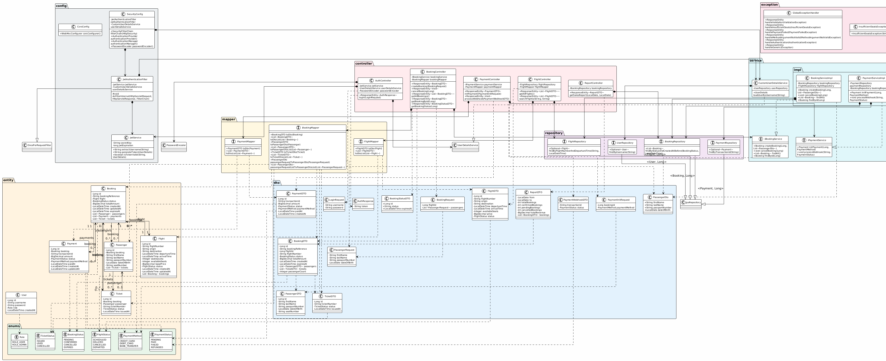

# Диаграмма классов проектирования

## Диаграмма



> Для регенерации изображения используй PlantUML-код из файла `backend-class-diagram.puml` в корне проекта.

---

## Серверная часть (Spring Boot)

### Слой Control

```
+---------------------------+       +---------------------------+
|      AuthController       |       |   BookingController       |
+---------------------------+       +---------------------------+
| - jwtService: JwtService  |       | - bookingService: IBookSvc|
| - userDetailsService      |       | - bookingMapper: BMapper  |
| - passwordEncoder         |       +---------------------------+
+---------------------------+       | + createBooking()         |
| + login()                 |       | + cancelBooking()         |
+---------------------------+       | + getAllBookings()        |
                                    | + getBookingById()        |
+---------------------------+       | + getBookingStatus()      +
|      FlightController     |       +---------------------------+
+---------------------------+
| - flightRepository        |       +---------------------------+
| - flightMapper            |       |   PaymentController       |
+---------------------------+       +---------------------------+
| + getAllFlights()         |       | - paymentService: IPaySvc |
| + searchFlights()         |       | - paymentMapper: PMapper  |
+---------------------------+       +---------------------------+
                                    | + initPayment()           |
+---------------------------+       | + processWebhook()        +
|    ReportController       |       +---------------------------+
+---------------------------+
| - bookingRepository       |
+---------------------------+
| + getSalesReport()        |
+---------------------------+
```

### Слой Mediator (Service)

```
+---------------------------+       +---------------------------+
|    BookingServiceImpl     |       |    PaymentServiceImpl     |
+---------------------------+       +---------------------------+
| - bookingRepository       |       | - paymentRepository       |
| - flightRepository        |       | - bookingRepository       |
+---------------------------+       +---------------------------+
| + createBooking()         |       | + initPayment()           |
| + cancelBooking()         |       | + processWebhook()        |
| + findAll()               |       +---------------------------+
| + findById()              |
+---------------------------+

+---------------------------+
|  CustomUserDetailsService |
+---------------------------+
| - userRepository          |
+---------------------------+
| + loadUserByUsername()    |
+---------------------------+
```

### Слой Entity (JPA)

```
+---------------------------+
|          Flight           |
+---------------------------+
| - id: Long                |
| - flightNumber: String    |
| - origin: String          |
| - destination: String     |
| - departureTime: LDT      |
| - arrivalTime: LDT        |
| - seatsQuota: Integer     |
| - availableSeats: Integer |
| - basePrice: BigDecimal   |
| - status: FlightStatus    |
| - bookings: List<Booking> |
+---------------------------+

+---------------------------+       +---------------------------+
|         Booking           |       |        Passenger          |
+---------------------------+       +---------------------------+
| - id: Long                |       | - id: Long                |
| - bookingReference: String|       | - booking: Booking        |
| - flight: Flight          |       | - firstName: String       |
| - status: BookingStatus   |       | - lastName: String        |
| - totalAmount: BigDecimal |       | - passportNumber: String  |
| - createdAt: LDT          |       | - dateOfBirth: LocalDate  |
| - expiresAt: LDT          |       | - seatNumber: String      |
| - passengers: List<Psg>   |       | - tickets: List<Ticket>   |
| - payments: List<Payment> |       +---------------------------+
| - tickets: List<Ticket>   |
+---------------------------+

+---------------------------+       +---------------------------+
|         Payment           |       |         Ticket            |
+---------------------------+       +---------------------------+
| - id: Long                |       | - id: Long                |
| - booking: Booking        |       | - booking: Booking        |
| - transactionId: String   |       | - passenger: Passenger    |
| - amount: BigDecimal      |       | - ticketNumber: String    |
| - status: PaymentStatus   |       | - status: TicketStatus    |
| - paymentMethod: PMethod  |       | - issuedAt: LDT           |
| - paidAt: LDT             |       +---------------------------+
+---------------------------+

+---------------------------+
|          User             |
+---------------------------+
| - id: Long                |
| - username: String        |
| - password: String        |
| - role: Role              |
| - createdAt: LDT          |
+---------------------------+
```

### Слой Foundation (Repository)

```
+---------------------------+       +---------------------------+
|     BookingRepository     |       |     FlightRepository      |
+---------------------------+       +---------------------------+
| extends JpaRepository     |       | extends JpaRepository     |
+---------------------------+       +---------------------------+
| + findByStatusAndCreated  |       | + findByFlightNumberAnd   |
|   AtBefore()              |       |   DepartureTime()         |
+---------------------------+       +---------------------------+

+---------------------------+       +---------------------------+
|     PaymentRepository     |       |      UserRepository       |
+---------------------------+       +---------------------------+
| extends JpaRepository     |       | extends JpaRepository     |
+---------------------------+       +---------------------------+
| + findByTransactionId()   |       | + findByUsername()        |
+---------------------------+       +---------------------------+
```

---

## Клиентская часть (React + TypeScript)

### Слой Presentation (Pages)

```
+---------------------------+       +---------------------------+
|        HomePage           |       |       SearchPage          |
+---------------------------+       +---------------------------+
| - Форма входа             |       | - Форма поиска рейсов     |
| - Валидация полей         |       | - Список результатов      |
+---------------------------+       +---------------------------+

+---------------------------+       +---------------------------+
|       BookingPage         |       |       PaymentPage         |
+---------------------------+       +---------------------------+
| - Multi-passenger form    |       | - Список платежей         |
| - React Hook Form + Zod   |       | - Инициализация оплаты    |
+---------------------------+       +---------------------------+
```

### Слой Store (Zustand)

```
+---------------------------+       +---------------------------+
|       authStore           |       |      bookingStore         |
+---------------------------+       +---------------------------+
| - username: string | null |       | - currentBooking: Booking |
| - roles: string[]         |       | - bookings: Booking[]     |
| - isAuthenticated: bool   |       +---------------------------+
+---------------------------+       | + setCurrentBooking()     |
| + setAuth()               |       | + addBooking()            |
| + logout()                |       +---------------------------+
| + hasRole()               |
+---------------------------+
```

### Слой API (Axios)

```
+---------------------------+
|        apiClient          |
+---------------------------+
| - baseURL: /api           |
+---------------------------+
| Request interceptor:      |
|   + Authorization: Bearer |
| Response interceptor:     |
|   + 401 → logout          |
+---------------------------+
```
