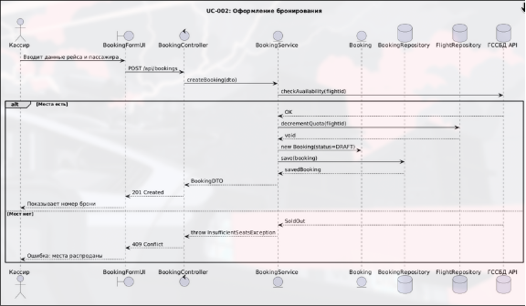
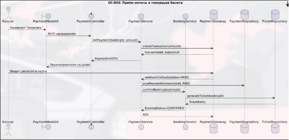
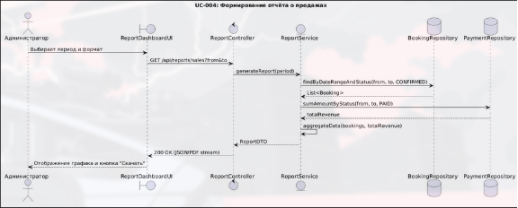

# Диаграммы последовательности

Описывают динамику взаимодействия компонентов системы при выполнении ключевых сценариев.

---

## UC-002: Аутентификация пользователя



**Участники:** `HomePage` → `apiClient` → `AuthController` → `CustomUserDetailsService` → `UserRepository`

```plantuml
@startuml UC-02-Authentication
title UC-002: Аутентификация пользователя

skinparam sequenceMessageAlign center
skinparam responseMessageBelowArrow true

actor "Кассир" as User
participant "HomePage\n(React)" as HP
participant "apiClient\n(Axios)" as AC
participant "AuthController\n(Spring)" as AuthC
participant "CustomUserDetailsService" as CUS
participant "JwtService" as JWT
database "UserRepository\n(PostgreSQL)" as UR

User -> HP : Вводит логин и пароль,
нажимает «Войти»
activate HP

HP -> AC : POST /auth/login
{username, password}
activate AC

AC -> AuthC : LoginRequest(username, password)
activate AuthC

AuthC -> CUS : loadUserByUsername(username)
activate CUS

CUS -> UR : findByUsername(username)
activate UR
UR --> CUS : Optional<User>
deactivate UR

alt Пользователь не найден
    CUS --> AuthC : throw UsernameNotFoundException
    AuthC --> AC : HTTP 401 Unauthorized
    AC --> HP : onError(401)
    HP --> User : Показывает сообщение об ошибке
else Пользователь найден
    CUS --> AuthC : UserDetails
    deactivate CUS

    AuthC -> JWT : generateToken(UserDetails)
    activate JWT
    JWT --> AuthC : token
    deactivate JWT

    AuthC --> AC : HTTP 200 OK + AuthResponse(token)
    deactivate AuthC

    AC --> HP : onSuccess(AuthResponse)
    deactivate AC

    HP -> HP : localStorage.setItem('aviacassa_jwt', token)
    HP -> HP : navigate('/search')
    HP --> User : Переход на страницу поиска рейсов
    deactivate HP
end

@enduml
```

---

## UC-003: Создание бронирования



**Участники:** `BookingPage` → `BookingForm` → `apiClient` → `BookingController` → `BookingServiceImpl` → `BookingRepository` / `FlightRepository`

```plantuml
@startuml UC-03-CreateBooking
title UC-003: Создание бронирования

skinparam sequenceMessageAlign center
skinparam responseMessageBelowArrow true

actor "Кассир" as User
participant "BookingPage\n(React)" as BP
participant "BookingForm\n(React Hook Form)" as BF
participant "apiClient\n(Axios)" as AC
participant "BookingController\n(Spring)" as BC
participant "BookingServiceImpl" as BS
database "BookingRepository\n(PostgreSQL)" as BR
database "FlightRepository" as FR

User -> BP : Выбирает рейс, нажимает «Забронировать»
activate BP

BP -> BF : Открывает форму с пассажирами
activate BF

User -> BF : Заполняет данные пассажиров,
нажимает «Подтвердить бронирование»

BF -> BF : zodResolver(bookingFormSchema) — валидация

BF -> AC : POST /bookings
{flightId, passengers[]}
Authorization: Bearer <JWT>
activate AC

AC -> BC : BookingRequest
activate BC

BC -> BS : createBooking(flightId, passengers)
activate BS

BS -> FR : findById(flightId)
activate FR
FR --> BS : Flight

alt Недостаточно мест
    FR --> BS : availableSeats < passengers.size
    BS --> BC : throw InsufficientSeatsException
    BC --> AC : HTTP 409 Conflict
    AC --> BF : onError(409)
    BF --> User : «Недостаточно свободных мест»
else Мест достаточно
    FR --> BS : ok
    deactivate FR

    BS -> BS : Генерация bookingReference,
    расчёт totalAmount,
    уменьшение availableSeats

    BS -> BR : save(booking)
    activate BR
    BR --> BS : Booking(id)
    deactivate BR

    BS --> BC : Booking
    deactivate BS

    BC --> AC : HTTP 201 Created + BookingDTO
    deactivate BC

    AC --> BF : onSuccess(BookingDTO)
    deactivate AC

    BF -> BF : setCurrentBooking(booking)
    BF -> BF : navigate(`/payment/${booking.id}`)
    BF --> User : Переход на страницу оплаты
    deactivate BF
end

deactivate BP

@enduml
```

---

## UC-004: Оплата бронирования



**Участники:** `PaymentPage` → `apiClient` → `PaymentController` → `PaymentServiceImpl` → `PaymentRepository` / `BookingRepository`

```plantuml
@startuml UC-04-Payment
title UC-004: Оплата бронирования

skinparam sequenceMessageAlign center
skinparam responseMessageBelowArrow true

actor "Кассир" as User
participant "PaymentPage\n(React)" as PP
participant "apiClient\n(Axios)" as AC
participant "PaymentController\n(Spring)" as PC
participant "PaymentServiceImpl" as PS
database "PaymentRepository" as PR
database "BookingRepository" as BR

User -> PP : Выбирает способ оплаты,
нажимает «Оплатить»
activate PP

PP -> AC : POST /payments
{bookingId, paymentMethod}
Authorization: Bearer <JWT>
activate AC

AC -> PC : PaymentInitRequest
activate PC

PC -> PS : initPayment(bookingId, paymentMethod)
activate PS

PS -> BR : findById(bookingId)
activate BR
BR --> PS : Booking

alt Бронирование не найдено
    BR --> PS : Optional.empty
    PS --> PC : throw EntityNotFoundException
    PC --> AC : HTTP 404 Not Found
    AC --> PP : onError(404)
    PP --> User : «Бронирование не найдено»
else Бронирование найдено
    BR --> PS : Booking
    deactivate BR

    PS -> PS : Генерация transactionId,
    создание Payment(PENDING)

    PS -> PR : save(payment)
    activate PR
    PR --> PS : Payment(id)
    deactivate PR

    PS --> PC : Payment
    deactivate PS

    PC --> AC : HTTP 201 Created + PaymentDTO
    deactivate PC

    AC --> PP : onSuccess(PaymentDTO)
    deactivate AC

    PP -> PP : Показывает статус «Ожидает оплаты»
    PP --> User : Информация о платеже
    deactivate PP
end

note over PC, PS
Вебхук от платёжной системы:
POST /payments/webhook
{transactionId, status: PAID}
→ processWebhook() → обновляет Payment и Booking статусы
end note

@enduml
```

---

## Как сгенерировать диаграммы

1. Скопируй код между `@startuml` и `@enduml`
2. Вставь на сайт **[plantuml.com/plantuml](https://www.plantuml.com/plantuml/uml/)** или используй локальную утилиту PlantUML
3. Сохрани результат в папку `docs/04-detailed-design/images/`
