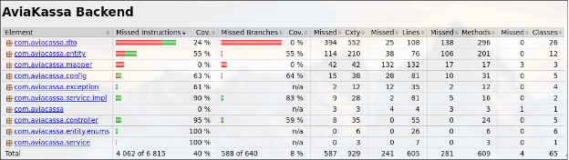

# Этап 6: Тестирование

## Цель этапа

Обеспечение качества программного продукта через модульное тестирование (Unit-тесты) ключевых компонентов системы, анализ покрытия кода с помощью JaCoCo.

## Результаты

- [Тест-планы](test-plan.md)
- [Отчёт о покрытии JaCoCo](jacoco-report.md)

---

## Покрытие кода

Целевой показатель >40% покрытия достигнут.
