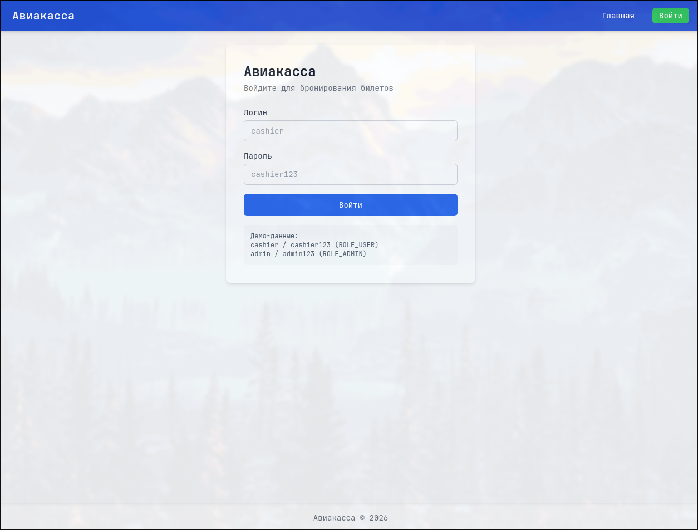
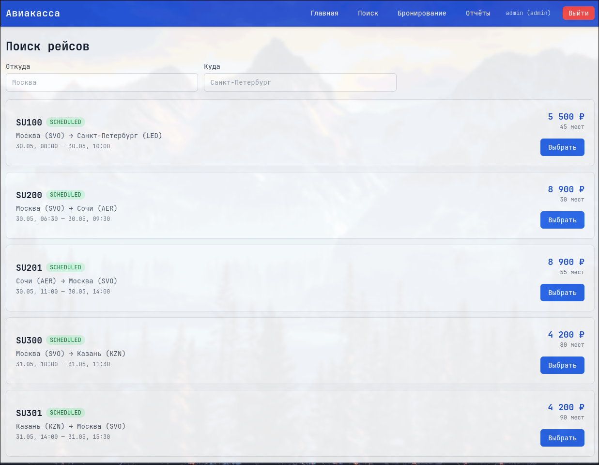
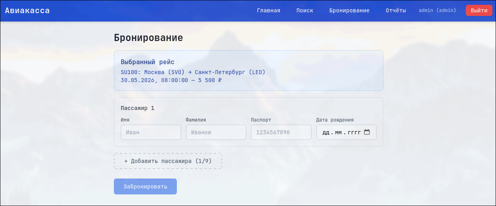
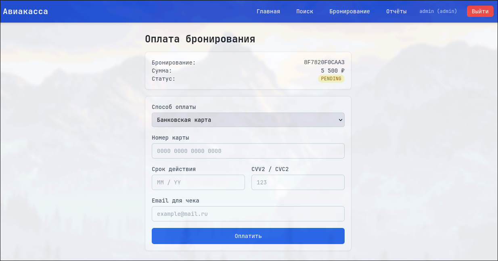
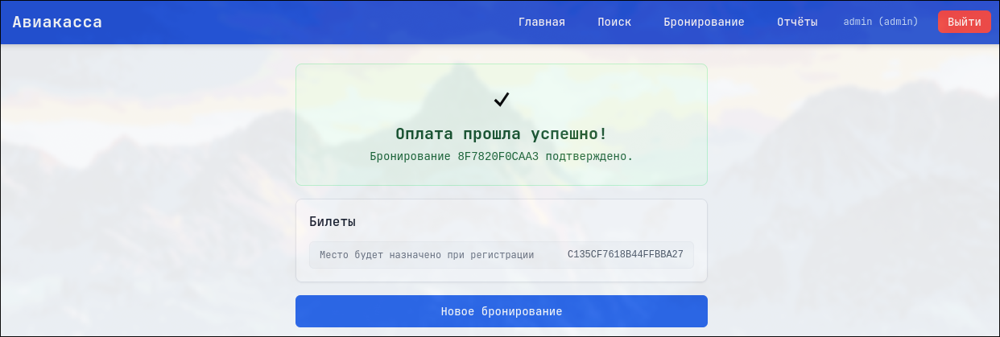
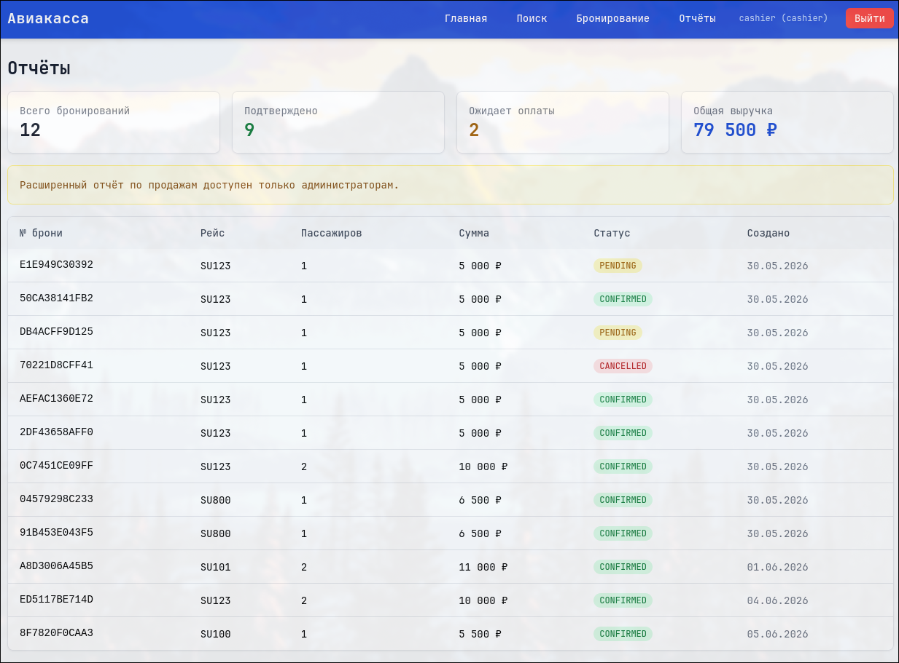
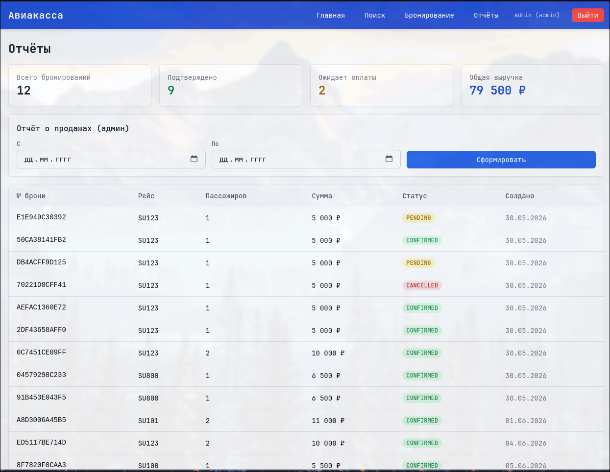

# Этап 8: Пользовательский интерфейс

## Цель этапа

Разработка и документирование пользовательского интерфейса веб-приложения «Авиакасса» на React + TypeScript + Tailwind CSS.

## Результаты

- Реализованы все экраны приложения
- UI адаптирован под десктопные браузеры
- Использована библиотека Tailwind CSS для стилизации

---

## Экраны приложения

### Экран входа

Форма аутентификации кассира. Поля: логин, пароль. При успешном входе — редирект на страницу поиска рейсов.

---

### Экран поиска рейсов

Панель поиска с фильтрами по пункту отправления и назначения. Таблица результатов с информацией о рейсах: номер, маршрут, время, доступные места, цена.

---

### Экран бронирования

Многошаговая форма оформления бронирования. Динамический список пассажиров (добавление/удаление). Валидация полей через React Hook Form + Zod. Отображение выбранного рейса и итоговой суммы.

---

### Экран оплаты

Инициализация платежа для выбранного бронирования. Выбор способа оплаты (кредитная карта, дебетовая карта, банковский перевод).

---

### Экран успешной оплаты

Подтверждение успешного платежа. Отображение номера бронирования, деталей рейса и пассажиров. Возможность распечатать билет.

---

### Экран отчётов кассира

Сводка по бронированиям текущего кассира: количество, сумма, статусы. Возможность фильтрации по дате.

---

### Экран отчётов администратора

Расширенный отчёт по продажам за период. Доступен только для роли ADMIN. Включает: общую выручку, количество бронирований, распределение по статусам.

---

## Технологический стек

- **React 18.3.1** — библиотека UI
- **TypeScript 5.4.5** — типизация
- **Vite 5.2.12** — сборщик
- **Tailwind CSS 3.4.19** — утилитарный CSS-фреймворк
- **React Router DOM 6.23.1** — клиентская маршрутизация
- **Zustand 4.5.2** — управление состоянием
- **Axios 1.7.2** — HTTP-клиент
- **React Hook Form 7.51.5** — управление формами
- **Zod 3.23.8** — валидация схем
