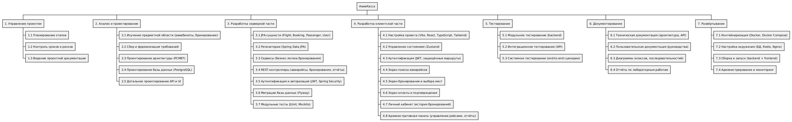

# Управление проектом

## Цель этапа

Обеспечение эффективного управления процессом разработки системы бронирования авиабилетов «АвиаКасса» через планирование работ, оценку трудозатрат и управление рисками.

## Результат

Разработан план проекта, включающий иерархическую структуру работ (WBS), диаграмму Ганта с календарным планом и оценку трудозатрат по модели COCOMO. План отражает все этапы создания полнофункционального веб-приложения для поиска и бронирования авиабилетов: от проектирования архитектуры до развёртывания в контейнерной среде Docker.

## Ключевые артефакты этапа

[Иерархическая структура работ](wbs.md)  
[Диаграмма Ганта](gantt.md)  
[Оценка затрат CoCoMo](cocomo.md)

## Скриншоты

_Рис. 1 — WBS: декомпозиция проекта АвиаКасса на работы и задачи_

_Рис. 2 — Диаграмма Ганта: календарный план разработки (март — май 2026)_
