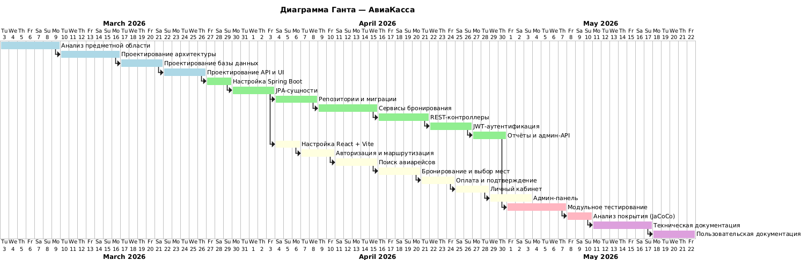
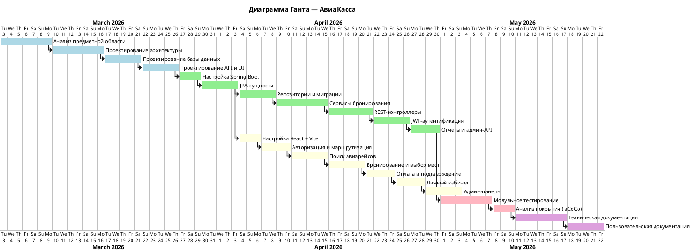

# Диаграмма Ганта

## Цель этапа

Визуализировать временные рамки выполнения каждой работы и их взаимосвязи для проекта «АвиаКасса».

## Результат

Построена диаграмма Ганта, отражающая календарный план разработки веб-приложения для бронирования авиабилетов в период с марта по май 2026 года. Диаграмма охватывает проектирование, разработку backend (Spring Boot), разработку frontend (React), тестирование и документирование.

## Диаграмма Ганта

## PlantUML код

