# WBS (Иерархическая структура работ)

## Цель этапа

Декомпозировать проект «АвиаКасса» на отдельные работы и задачи для планирования ресурсов, контроля сроков и оценки трудозатрат.

## Результат

Составлена иерархическая структура работ (Work Breakdown Structure), охватывающая весь жизненный цикл разработки: от управления проектом и анализа требований до развёртывания системы бронирования авиабилетов.

## Иерархическая структура работ для проекта АвиаКасса

## PlantUML код

```plantuml
@startwbs
* АвиаКасса
** 1. Управление проектом
*** 1.1 Планирование этапов
*** 1.2 Контроль сроков и рисков
*** 1.3 Ведение проектной документации
** 2. Анализ и проектирование
*** 2.1 Изучение предметной области (авиабилеты, бронирование)
*** 2.2 Сбор и формализация требований
*** 2.3 Проектирование архитектуры (PCMEF)
*** 2.4 Проектирование базы данных (PostgreSQL)
*** 2.5 Детальное проектирование API и UI
** 3. Разработка серверной части
*** 3.1 JPA-сущности (Flight, Booking, Passenger, User)
*** 3.2 Репозитории (Spring Data JPA)
*** 3.3 Сервисы (бизнес-логика бронирования)
*** 3.4 REST-контроллеры (авиарейсы, бронирования, отчёты)
*** 3.5 Аутентификация и авторизация (JWT, Spring Security)
*** 3.6 Миграции базы данных (Flyway)
*** 3.7 Модульные тесты (JUnit, Mockito)
** 4. Разработка клиентской части
*** 4.1 Настройка проекта (Vite, React, TypeScript, Tailwind)
*** 4.2 Управление состоянием (Zustand)
*** 4.3 Аутентификация (JWT, защищённые маршруты)
*** 4.4 Экран поиска авиарейсов
*** 4.5 Экран бронирования и выбора мест
*** 4.6 Экран оплаты и подтверждения
*** 4.7 Личный кабинет (история бронирований)
*** 4.8 Административная панель (управление рейсами, отчёты)
** 5. Тестирование
*** 5.1 Модульное тестирование (backend)
*** 5.2 Интеграционное тестирование (API)
*** 5.3 Системное тестирование (end-to-end сценарии)
** 6. Документирование
*** 6.1 Техническая документация (архитектура, API)
*** 6.2 Пользовательская документация (руководства)
*** 6.3 Диаграммы (классов, последовательностей)
*** 6.4 Отчёты по лабораторным работам
** 7. Развёртывание
*** 7.1 Контейнеризация (Docker, Docker Compose)
*** 7.2 Настройка окружения (БД, Redis, Nginx)
*** 7.3 Сборка и запуск (backend + frontend)
*** 7.4 Администрирование и мониторинг
@endwbs
```

